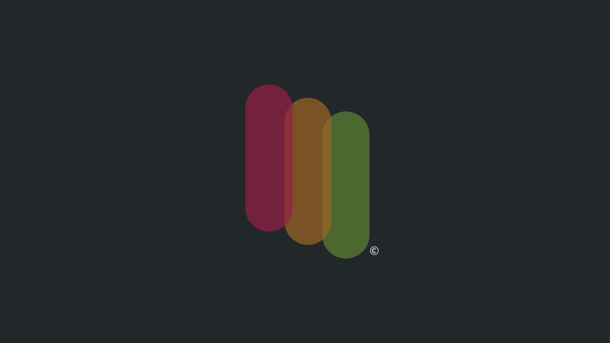
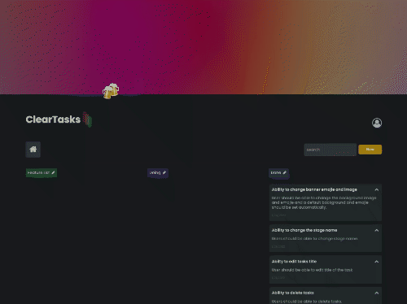
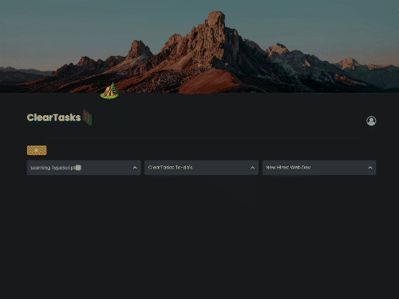
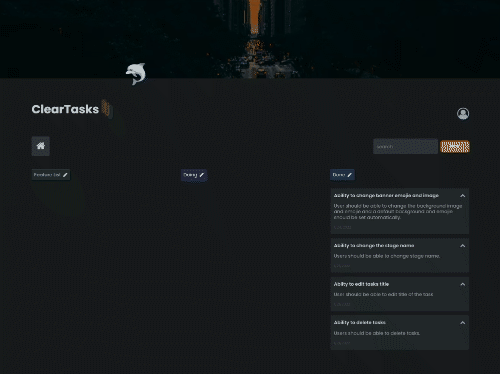

<div id="top"></div>

<!-- PROJECT LOGO -->
<br />
<div align="center">
  <a href="https://github.com/tedtalksbits/taskify/blob/main/src/screenshots/taskify-2.gif">
    
  </a>

  <h3 align="center">ClearTasks: An app inspired by Notion</h3>

  <p align="center">
    ClearTasks &copy; is a task manager that helps you stay productive and organized by separating your tasks in groups and catergories.
    <br />
    <br />
    <br />
    <a href="https://tedtalksbits.github.io/cleartasks/#/cleartasks">View Demo</a>
  </p>
</div>


<!-- TABLE OF CONTENTS -->
<details>
  <summary>Table of Contents</summary>
  <ol>
    <li>
      <a href="#about-the-project">About The Project</a>
      <ul>
        <li><a href="#built-with">Built With</a></li>
      </ul>
    </li>
    <li>
      <a href="#getting-started">Getting Started</a>
      <ul>
        <li><a href="#prerequisites">Prerequisites</a></li>
        <li><a href="#installation">Installation</a></li>
      </ul>
    </li>
    <li><a href="#usage">Usage</a></li>
    <li><a href="#roadmap">Roadmap</a></li>
    <li><a href="#contributing">Contributing</a></li>
    <li><a href="#license">License</a></li>
    <li><a href="#contact">Contact</a></li>
    <li><a href="#acknowledgments">Acknowledgments</a></li>
  </ol>
</details>


<!-- ABOUT THE PROJECT -->
## About The Project🎙
<h3>A Notion inspired task manager </h3>

<hr>
How to use:

- Sign in with google
- create a new group
- add as many items to the group as you want


<p align="right">(<a href="#top">back to top</a>)</p>


### Features:

<b>1. Customization </b>

<p>You can customize each page to your liking. Choose image and emojie that best fit the tasks on the page</p>
<hr>

<b>2. Organization</b>

<p>Organize each tasks by grouping similar items</p>
<hr>

<b>3. Stages</b>

<p>Stage items in three different categories. Categories can can be changed and renamed by the user </p>
<hr>

### Built With🛠

* [React.js](https://reactjs.org/)
* [Styled Components](https://styled-components.com/) <-- all components were custom styled✨>
* [MongoDB](https://www.npmjs.com/package/json-server)
* [Hosted by Heroku](https://id.heroku.com/)


<p align="right">(<a href="#top">back to top</a>)</p>


<!-- GETTING STARTED -->
## Getting Started😀

This app only have a few dependencies (very lightweight) 
namely: 
- styled-components [learn more](https://www.npmjs.com/package/styled-components)
- react-router-dom [learn more](https://www.npmjs.com/package/react-router-dom/v/6.0.0-beta.0)

### Prerequisites😤

You will need the latest version of node
* npm
  ```sh
  npm install npm@latest -g
  ```

### Installation⬇️

_To run this app locally_

1. Download or clone this repo

   ```sh
   git clone https://github.com/tedtalks_bits/cleartasks.git
   ```
3. Install NPM packages
   ```sh
   npm install
   ```
4. Run the app locally `config.js`
   ```sh
   npm start
   ```

<p align="right">(<a href="#top">back to top</a>)</p>


<p align="right">(<a href="#top">back to top</a>)</p>


<!-- ROADMAP -->
## Roadmap🛣

- [x] Custom components
- [x] Add dynamic + responsive grid system
- [x] Full CRUD features
- [x] User Customizabiltity 
  - [x] Users can change emojies, images, task stage colors
- [x] Google sign in 


<p align="right">(<a href="#top">back to top</a>)</p>


<!-- CONTACT -->
## Contact📞

Tedane Blake(twitter) - [@iam_tcb](https://twitter.com/iam_tcb)

My website: [https://tedtalksbits.github.io/tedaneblakedev/](https://tedtalksbits.github.io/tedaneblakedev/)

<p align="right">(<a href="#top">back to top</a>)</p>


<!-- ACKNOWLEDGMENTS -->
## Acknowledgments

Like I mention at the top of the page, This app was heavily influenced by [Notion](https://www.notion.so/). I enjoy using Notion, I just wish there was a lite version because of how robust(cluttered) the app is. So I was inspired to revamp one of the first apps I ever made and converted it to what I am calling: **ClearTasks**.

* [Notion](https://www.notion.so/)

<p align="right">(<a href="#top">back to top</a>)</p>

